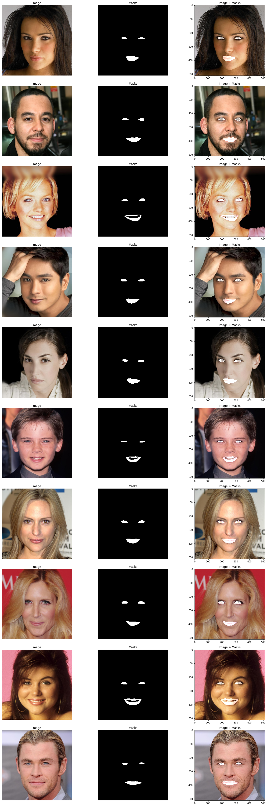
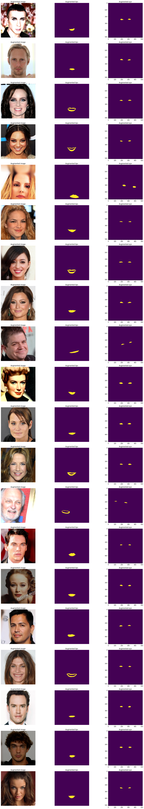

# Eyes & Lips Segmentation

Dataset: **CelebA**  
Model: **U-net based**  
Loss: **DiceLoss**  
Evaluation Matrix: **Dice Score**  
Dice Score on Test Dataset: **0.89**  

### Sample Result on Test Dataset:

## Data Preprocessing

Combined eyes & lips seperately. So in case model facing difficultly to learn any specific feature, we can add more capacity for that feature.

Data augumentation: shift, scale, rotate, random brightness & contrast

**Dataloader Output:**

## Loss Function

Generally BCEWithLogitsLoss & DiceLoss can be used as loss function  
Here BCEWithLogitsLoss can't used because mask area/image ratio very very less. BCEWithLogitsLoss is based on pixel to pixel comparision. so even model give complete blank output (black image), BCEWithLogitsLoss will be very less & thus model won't be trained

Intuitively **DiceLoss** gives equal important to mask & non-mask area & differentiable. So it's preferred choice

## Evaluation metrics

One can use IOU or Dice score as evalution.
Both increase with overlapping area & will be zero when no overlap

Dice score is slightly more prefer option as it measure something closer to avg performance while IOU measure something closer to wrost case performance. (Dice Score >= IOU)

## HyperParameter

lr = 0.01  
optimizer = SGD  
train_test_split = 0.9  
batch_size = 16  
epochs = 5  
